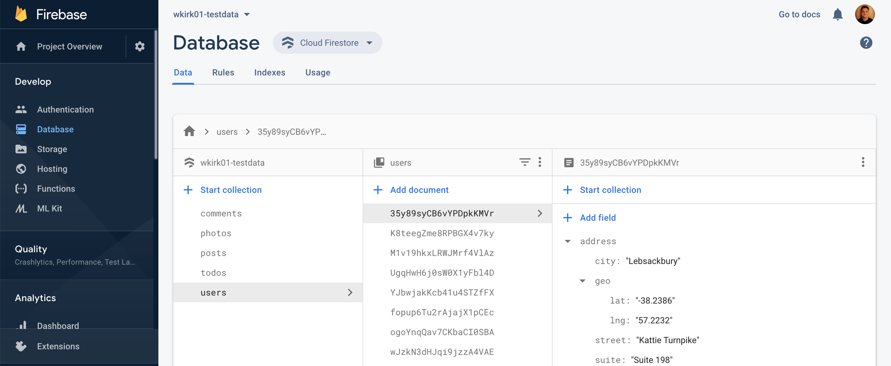

## Test Database

This codebase can be used to help populate a FireStore database with test data from [JSONPlaceholder](https://jsonplaceholder.typicode.com/) to be used in demo projects.

<p align="center">
  <a target="blank"></a>
</p>

## Instructions 

Install depenedencies
```
yarn install-dependencies
``` 

Add a file to the root directory called `Firestore.ts` and export a constant `firebaseconfig` which holds your firebase serivce account credentials. 

```typescript
export const firebaseconfig = {
    "type": "...",
    "project_id": "...",
    "private_key_id": "...",
    "private_key": "...",
    "client_email": "...",
    "client_id": "...",
}
```

Save data to the database

```
yarn run
```

